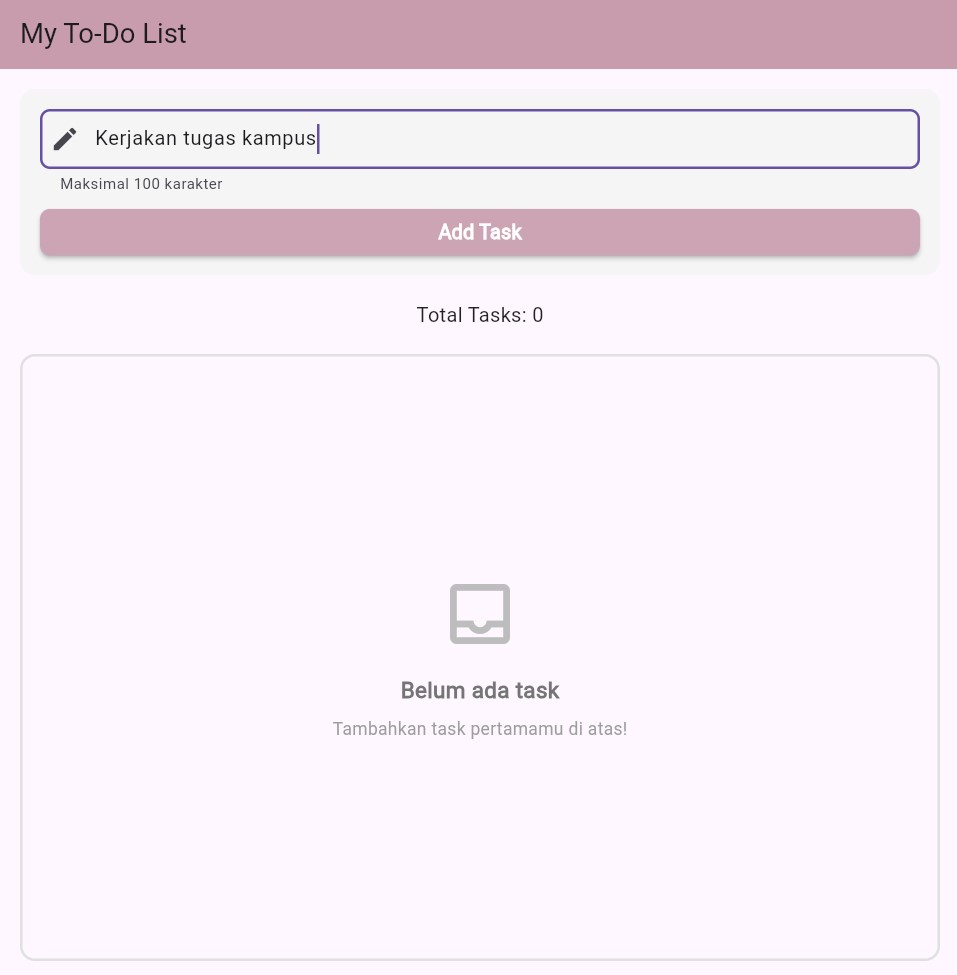
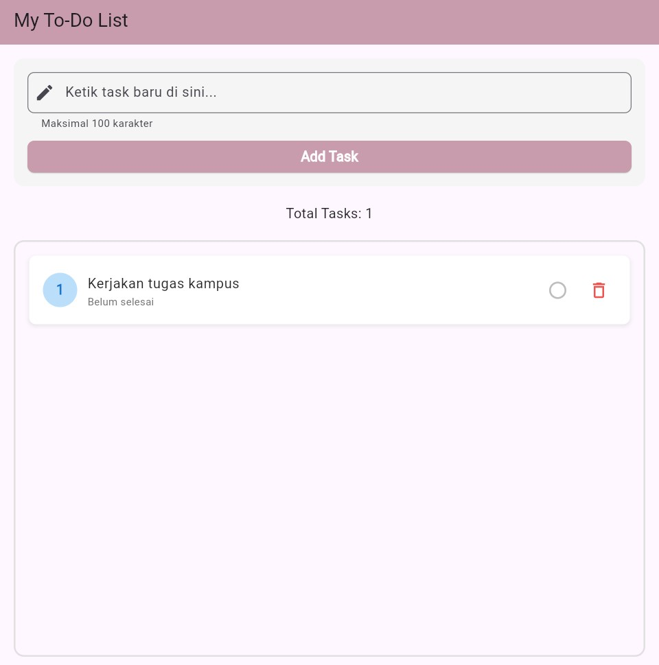
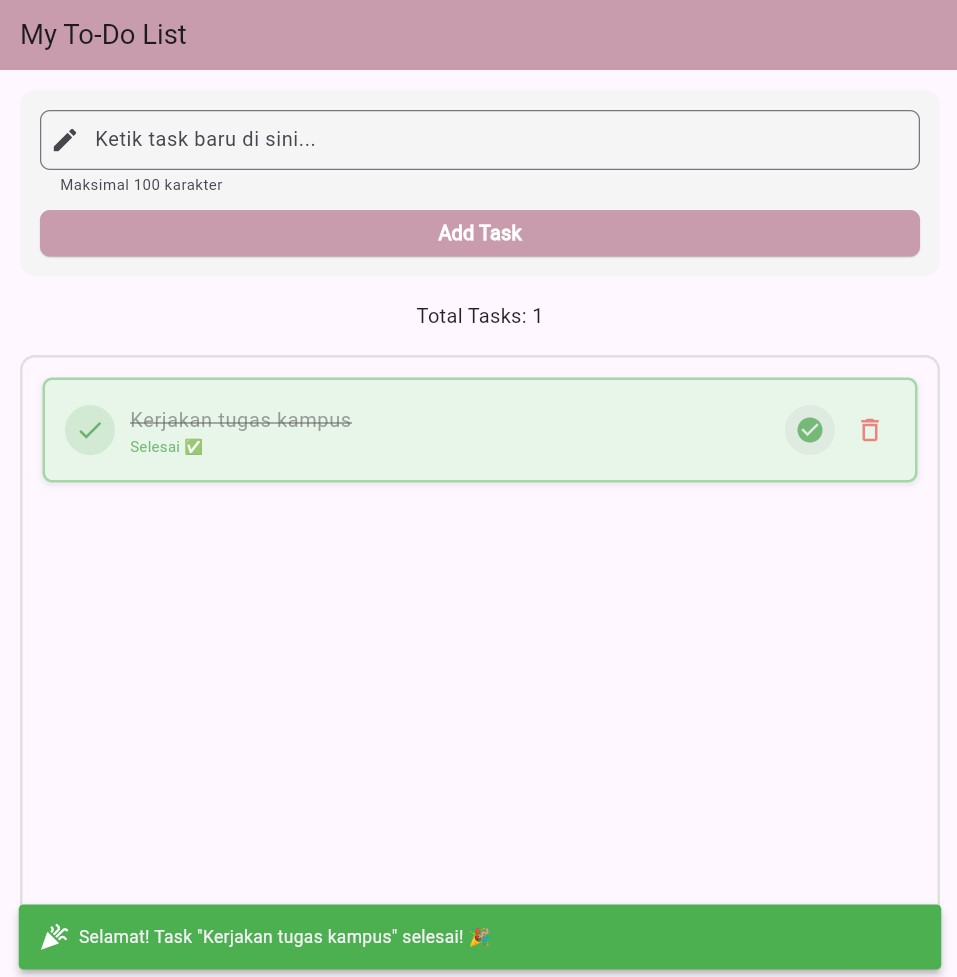
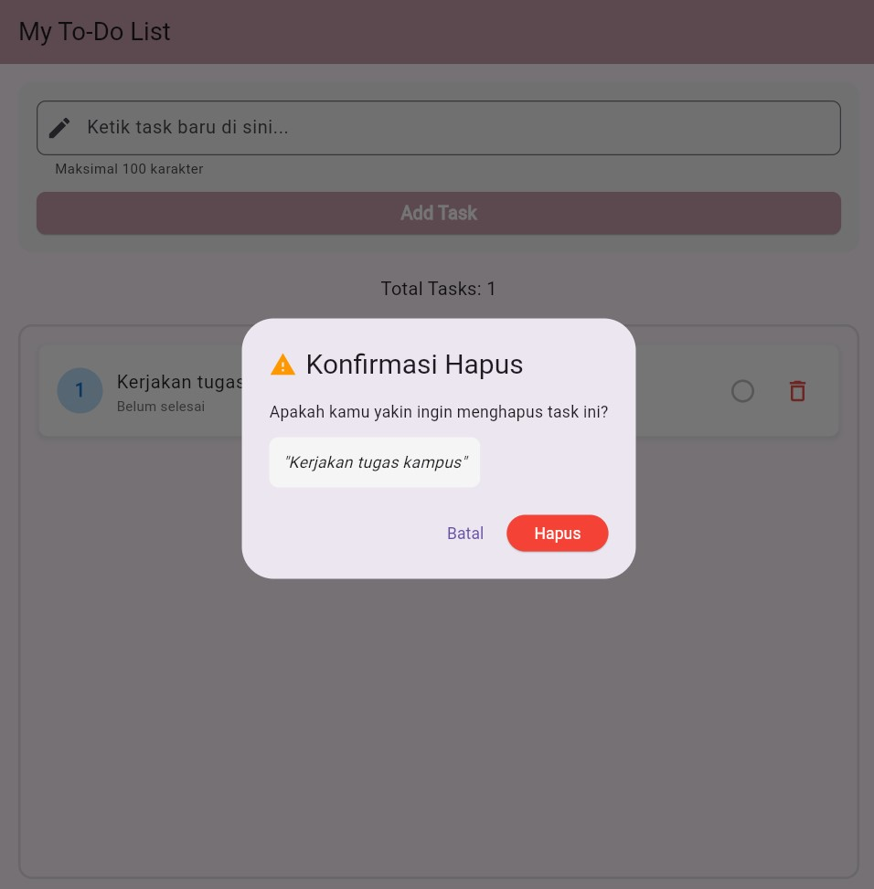

# 📝 Todo List App

Aplikasi Todo List sederhana yang dibuat menggunakan Flutter untuk mengelola tugas-tugas harian dengan antarmuka yang user-friendly dan fitur yang lengkap.

## 🎯 Fitur Utama

- **Tambah Task** - Menambahkan tugas baru dengan validasi input
- **Hapus Task** - Menghapus tugas dengan konfirmasi dialog
- **Toggle Status** - Menandai tugas selesai/belum selesai
- **Validasi Input** - Cek duplikasi, panjang karakter, dan input kosong
- **Feedback Visual** - SnackBar notifications untuk setiap aksi
- **UI Responsif** - Tampilan yang clean dan mudah digunakan
- **Counter Tasks** - Menampilkan jumlah total tugas
- **Empty State** - Tampilan khusus ketika belum ada tugas

## 🛠️ Teknologi yang Digunakan

- **Flutter**: Framework untuk pengembangan aplikasi mobile
- **Dart**: Bahasa pemrograman
- **Material Design**: Design system untuk UI/UX
- **StatefulWidget**: Untuk state management
- **Custom Model Class**: Task class untuk data structure

## 📱 Tampilan Aplikasi

### Screenshot Utama
<!-- Ganti dengan screenshot aplikasi Anda -->

### Tampilan Fitur

#### Form Input Task

#### Task List & Actions

#### Konfirmasi Delete

🎉 Dengan ini, kamu punya aplikasi todo list yang rapi dan professional!
